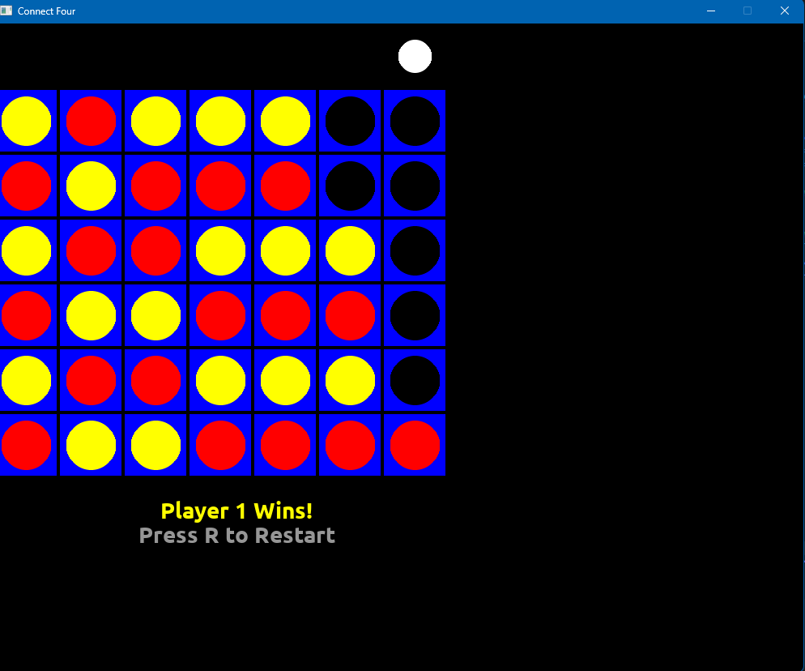

# Project 04 – [Your Game Name]
 
## 🕹️ Description
 
This is a turn-based grid game written in C++ using SDL2. Players take turns placing pieces using the keyboard and/or mouse.
 
## 🎮 Controls
 
- Click / use arrow keys to select
- Press Enter or click to place a piece
- Press `R` or click "Restart" to play again
- Press `Esc` to exit
 
## 🧪 Screenshot
 

 
## ✨ Extra Features
 
- Sound effects when placing
- Animated piece drops
- Highlighting current player